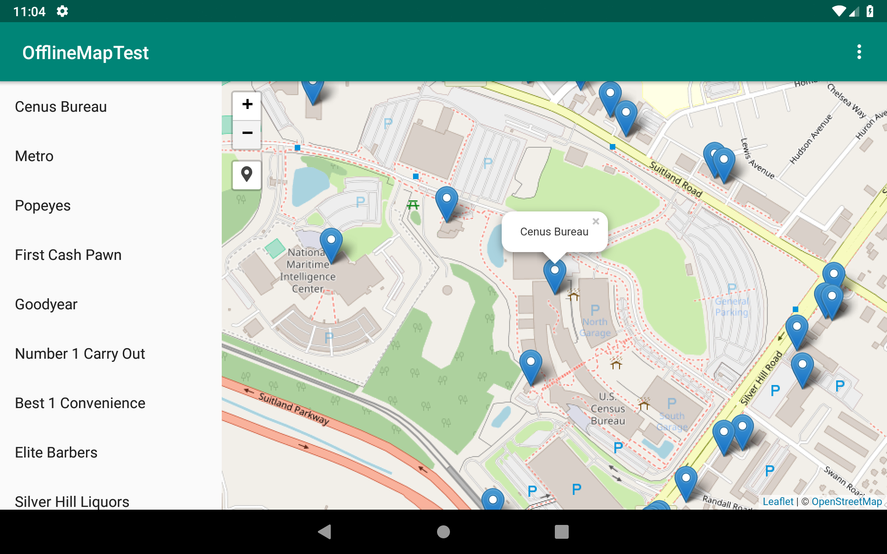

# AndroidOfflineMaps
Test bed for displaying offline maps on Android

Example Android application that displays offline maps using various mapping SDKs:

* [Google Maps SDK for Android](https://developers.google.com/maps/documentation/android-sdk/intro)
* [Mapbox SDK](https://www.mapbox.com/android-docs/maps/overview/)
* [Leaflet.js](https://leafletjs.com/) (in an embedded WebView)

The app displays a slippy map with tiles from a file on the device. No internet connection is required to display the maps (although you need to have an internet connection the very first time you run the app to validate the Google Maps SDK API key).

Currently only [mbtiles](https://github.com/mapbox/mbtiles-spec) files are supported. You can add your own map tiles by placing an mbtiles file in the directory _/mnt/sdcard/offlinemaps_. When the app is first run, it copies a set of tiles for Suitland, MD from Open Street Map into that directory. You can switch to a a different tiles file that you have placed in that directory by choosing _Tile source..._ from the menu.

You can switch to any of the three mapping SDKs by choosing _Map SDK..._ from the menu.

Currently only raster tiles are supported when using Google Maps SDK and Mapbox SDK. When using Leaflet, tiles in [Mapbox Vector Tile Format (pbf)](https://github.com/mapbox/vector-tile-spec) are supported although the map styling is rather ugly for the moment.

In addition to the map tiles, a set of placemarks are displayed on the map for various places in Suitland. Next to the map view, the list of places is displayed in a separate list. Tapping on a place in the list pans and zooms the map to show the placemarker. Tapping on the placemarker on the map scrolls the list to show the place name. The list of places is set in the file PlacesViewModel.java.

## Building

In order to build the project you will need to obtain a Google Maps API Key following the directions [here](https://developers.google.com/maps/documentation/android/start#get-key). Add this key in a string resource named "google_maps_key".

## Implementation

The offline maps are served by a local tile server running on the Android device (localhost:8084). The server is implemented using [NanoHttpd](https://github.com/NanoHttpd/nanohttpd). The mapping SDKs query the tile server to get the tiles to display. Reading of the mbtiles is done using a slightly modified version of [mbtiles4j](https://github.com/fullhdpixel/mbtiles4j).

The Leaflet.js implementation uses and an Android WebView that loads a local web page stored in the assets folder (assets/leaflet/index.html). Leaflet.js and all dependencies are stored in the assets folders and served via the NanoHttpd server.

## Todo

* Fix vector tile styling when using Leaflet.js
* Support vector tiles when using Mapbox SDK
* Show text pop-ups on markers in Mapbox SDK
* Show users current location when using Mapbox SDK
* Look at supporting [Geopackage](https://www.geopackage.org/)
